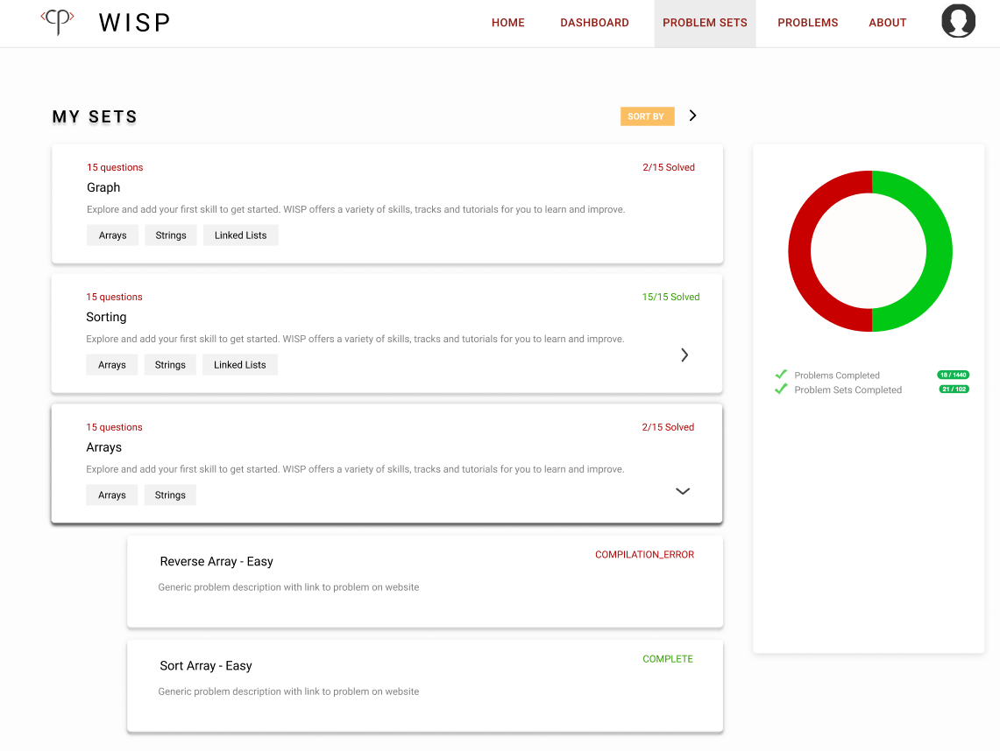
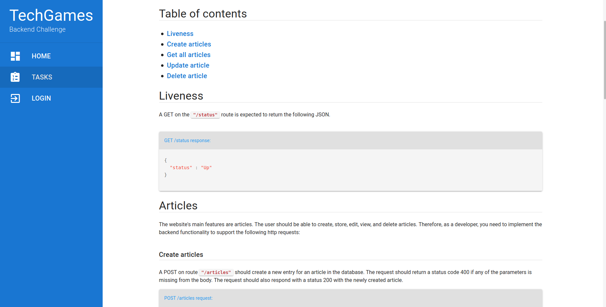
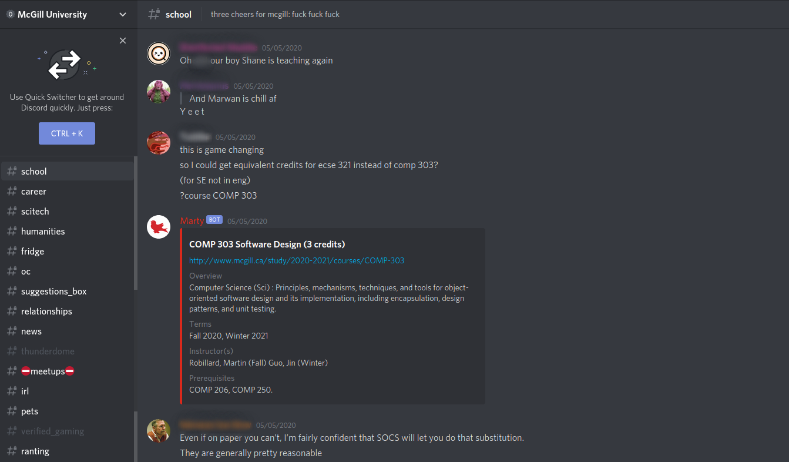
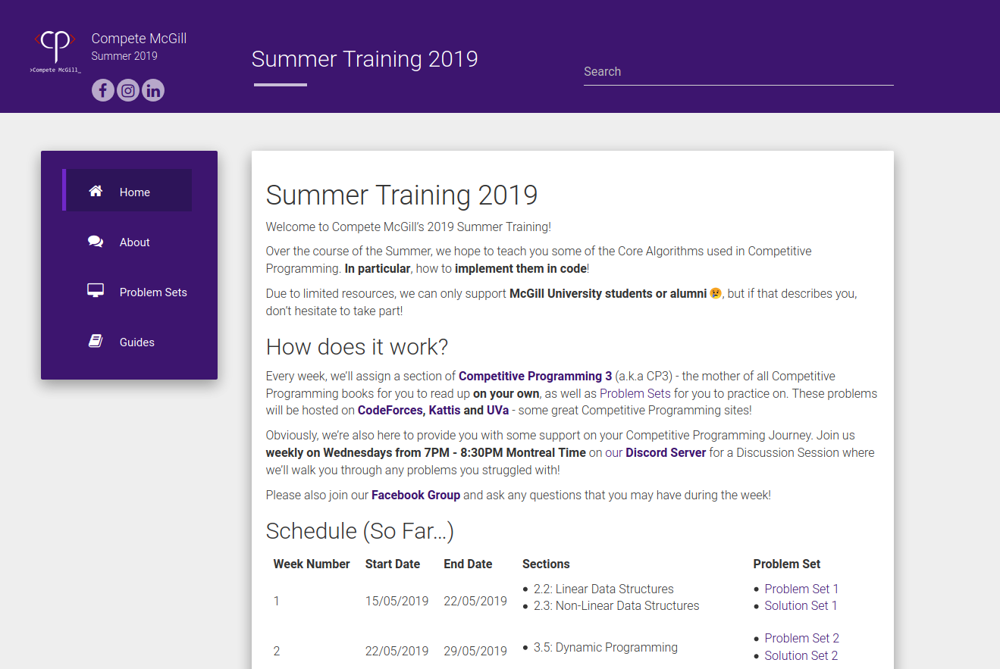
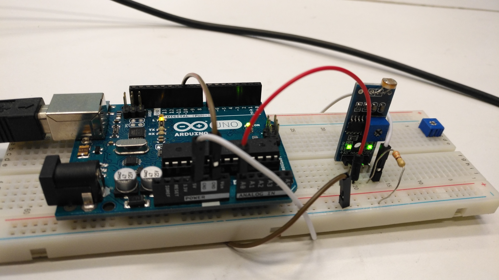

    

      

      

        <h1 class="ml11">
        
          
          {{ page.heading }}
        
        </h1>
        
{{ page.subheading }} 
        :computer: Software Engineer :coffee: Coffee Afficinado :violin: Violinist

      

    

    

      
      
      
    

    

      

        

          <a class="github-button" href="https://github.com/idodin" data-show-count="true" aria-label="Follow @idodin on GitHub">Follow @idodin</a>
        

      

    

  

  
  

    

      

        

          <ul>
            <li id="tab_summary" onclick="showAboutTabBox(this.id)">summary</li>
            <li id="tab_extracurriculars" onclick="showAboutTabBox(this.id)">
              extracurriculars
            </li>
            <li id="tab_projects" onclick="showAboutTabBox(this.id)">projects</li>
            <li id="tab_volunteer" onclick="showAboutTabBox(this.id)">volunteering</li>
            <li id="tab_music" onclick="showAboutTabBox(this.id)">music</li>
          </ul>
        

        <!--Summary STARTS-->
        

          

            

              

                "One hand alone does not clap." "ايد واحدة ما تسقفش"  <i
                  >Arabic Proverb</i
                > Any single effort of mine is a result of the support,
                kidness and belief of the countless friends and family around me -
                to them, I give my profuse gratitude.
              

              <h3>Biography</h3>
              

                :wave: Hey there! My name is Imad, I'm a Palestinian-Canadian student
                going into my last semester of Software Engineering at McGill
                University. I've kept myself busy during my time here and met so
                many great people! As I prepare to embark on this next chapter of
                my life, I hope this website can act as a brief summary of what
                I've done with my time (professionally and not) so far!
              

              

                :computer: I decided to commit to a career in tech to help empower others and
                hope that, in the future, I achieve just that goal. The particular
                fields which I'm interested in are Backend and Infrastructure
                Development, I am also extremely passionate about Model-Driven
                Engineering, Software Language Engineering and Distributed Systems
                / Cloud.
              

              

                :heart_eyes: I am most passionate about my extracurricular involvement
                (including social work), experience as a teaching assistant and
                personal projects so please check those out!
              

              

                :trophy: I was Coach for McGill University's 
                <a
                  href="https://www.youtube.com/watch?v=Ocwhap9nIx4&feature=youtu.be&t=27704" target="_blank"
                  >2020 World Finalist ICPC Team</a
                >. (Disclaimer: this achievement was all the team's - I was lucky
                to be along for the ride)
              

              

                :earth_americas: Prior to my time at McGill University, I lived in Geneva,
                Switzerland, New York City, and Halifax, Nova Scotia. While in
                Switzerland I spent much of my time helping acclimate Syrian
                refugees to life in Europe (tutoring children in
                Maths/Physics/Chemistry, translating and even helping some set up
                online businesses).
 
              
:video_game: I was also a
                <a href="https://osu.ppy.sh/users/2664682" target="_blank"
                  >highly ranked player</a
                >
                and organizer of the first ever Swiss National Tournament on the
                popular rhythm game, osu!. Sadly, my rank has decayed quite a bit and I don't play much
                anymore, but sometimes I log in to catch up with friends!
              

              

              :rotating_light: <b> Since the start of the COVID-19 Pandemic, I've been building Shopify Stores and Admin Panels free of charge
              for local businesses looking to transition to online platforms during this rough time. Please email me at <a href="mailto:imad@dodin.ca?Subject=COVID-19/Shopify">imad@dodin.ca</a> 
              if you are a local business that have been negatively impacted by the COVID-19 Pandemic.  :rainbow: Ca va bien aller. :rainbow:</b>

              <h3>Timeline</h3>
              <ul class="timeline">
                <li>
                  <b>2020</b> -
                  <a href="https://www.microsoft.com/en-ca" target="_blank">Microsoft</a>, Redmond
                  WA (Remote) - <b>Software Engineering Intern</b> - Microsoft
                  <a
                    href="https://www.microsoft.com/en-ca/microsoft-365/microsoft-teams/group-chat-software" target="_blank"
                    >Teams</a
                  >.
                </li>
                <li>
                  <b>2019-2020</b> -
                  <a href="https://www.facebook.com/CompeteMcGill"
                    >Competitive Programming at McGill</a
                  >
                  - <b>President / Coach</b>.
                </li>
                <li>
                  <b>2019</b> - <a href="https://www.amazon.ca/" target="_blank">Amazon</a>, Vancouver BC -
                  <b>Software Development Engineering Intern</b> - Amazon Web
                  Services
                  <a
                    href="https://aws.amazon.com/s3/" target="_blank"
                    >S3</a
                  >.
                </li>
                <li>
                  <b>2018-2020</b> -
                  <a href="https://www.mcgill.ca/ece/" target="_blank">McGill ECSE Department</a>
                  - <b>Course Assistant</b> -
                  <a href="https://www.mcgill.ca/study/2019-2020/courses/ecse-223" target="_blank"
                    >ECSE 223</a
                  >
                  /
                  <a href="https://www.mcgill.ca/study/2019-2020/courses/ecse-321" target="_blank"
                    >ECSE 321</a
                  >.
                </li>
                <li>
                  <b>2018-2020</b> - <a href="https://www.facebook.com/ssamcgillu" target="_blank">McGill Syrian Students Association</a> -
                  <b>Vice President (Media, Finance)</b>
                </li>
                <li>
                  <b>2018-2019</b> -
                  <a href="https://www.facebook.com/CompeteMcGill" target="_blank"
                    >Competitive Programming at McGill</a
                  >
                  - <b>VP Competitions / Training Lead</b>.
                </li>
                <li>
                  <b>2018</b> -
                  <a
                    href="https://www.chairs-chaires.gc.ca/chairholders-titulaires/profile-eng.aspx?profileID=2381" target="_blank"
                    >McGill Broadband Communications Lab</a
                  >
                  - <b>SURE Award Intern</b>.
                </li>
                <li>
                  <b>2018</b> - Helped found
                  <a href="https://www.facebook.com/CompeteMcGill" target="_blank"
                    >Competitive Programming at McGill</a
                  >.
                </li>
                <li>
                  <b>2017-2018</b> -
                  <a href="https://mcgillrobotics.com/" target="_blank">McGill Robotics</a> -
                  <b>Software Developer</b> (Autonomous Drone Team).
                </li>
                <li>
                  <b>2017-2018</b> - Helped establish a scholarship for displaced
                  Syrian students at McGill, as <b>Campaign Aide</b> for
                  <a href="https://www.facebook.com/BNBMcGill" target="_blank"
                    >Books Not Bombs McGill</a
                  >.
                </li>
                <li>
                  <b>2016-2020</b> -
                  <a href="https://www.mcgill.ca/" target="_blank">McGill University</a>, Montreal
                  - <b>Bachelor of Engineering in Software Engineering</b>.
                </li>
              </ul>
              

                This website acts as a brief portfolio and blog. Please listen to
                me ramble about:
              

              <ul>
                <li>
                  <a onclick="showAboutTabBox('tab_extracurriculars')">Extracurriculars</a> (The highlight of my time at McGill and the
                  thing I am most passionate about!)
                </li>
                <li>
                  <a onclick="showAboutTabBox('tab_projects')">Projects</a> (Research, Personal and Course) which I had fun with -
                  some are ommitted or short due to NDAs and the like.
                </li>
                <li>
                  <a href="{{ site.baseurl }}/blog">My Thoughts</a> (on Internships, Software Engineering and various
                  Global Affairs).
                </li>
                <li>
                  <a href="{{ site.baseurl }}/coffee">Coffee!</a> (I keep track of my various recipes after hours of
                  experimentation and lots of caffeine trembles!)
                </li>
              </ul>
              

                
In case you're wondering, this site

                <ul style="margin: 0px !important;">
                  <li>
                    Is based on that of
                    <a href="https://github.com/gogul09">@gogul09</a>.
                  </li>
                  <li>
                    Is hosted on
                    <a href="https://github.com/" target="_blank">GitHub Pages</a
                    >.
                  </li>
                  <li>
                    Is built on
                    <a href="https://jekyllrb.com/" target="_blank">Jekyll</a>.
                  </li>
                  <li>
                    Is developed on <a href="https://ubuntu.com/"> Ubuntu </a>, my
                    favorite Linux Distro (Sorry, Mint!)
                  </li>
                  <li>
                    Is written on my text-editor of choice,
                    <a href="https://code.visualstudio.com/">Visual Studio Code</a
                    >.
                  </li>
                  <li>
                    Uses fonts from
                    <a href="https://fonts.google.com/" target="_blank"
                      >Google Fonts</a
                    >.
                  </li>
                  <li>
                    Uses icons by
                    <a
                      href="https://www.flaticon.com/authors/flat-icons"
                      title="Flat Icons"
                      >Flat Icons</a
                    >
                    from
                    <a href="https://www.flaticon.com/" title="Flaticon"
                      >www.flaticon.com</a
                    >
                    licensed by
                    <a
                      href="http://creativecommons.org/licenses/by/3.0/"
                      title="Creative Commons BY 3.0"
                      target="_blank"
                      >CC 3.0 BY</a
                    >.
                  </li>
                </ul>
              

            

          

        

        <!--Extracurriculars START-->
        

          

            <button onclick="closeSidebar('extra_sidebar_tracker_content')">X</button>
            
Extracurriculars

            <ul id="extra_sidebar_tracker_content">
              <li><a onclick="handleSideBarLinks(this.id)" id="extra_link_1" class="sidebar_links" href="#compete-start">Competitive Programming at McGill</a>
              <ul style="padding: 0px 0px 0px 10px"><li><a onclick="handleSideBarLinks(this.id)" id="extra_link_2" class="sidebar_links" href="#compete-19">Co-President / Coach</a></li><li><a onclick="handleSideBarLinks(this.id)" id="extra_link_3" class="sidebar_links" href="#compete-18">VP Competitions / Training Lead</a></li></ul>
              </li>
              <li><a onclick="handleSideBarLinks(this.id)" id="extra_link_4" class="sidebar_links" href="#ta-start">Course Assistance</a>
              <ul style="padding: 0px 0px 0px 10px"><li><a onclick="handleSideBarLinks(this.id)" id="extra_link_5" class="sidebar_links" href="#ta-321">ECSE 321: Introduction to Software Engineering</a></li><li><a onclick="handleSideBarLinks(this.id)" id="extra_link_6" class="sidebar_links" href="#ta-223">ECSE 223: Model-Based Programming</a></li></ul>
              </li>
              <li><a onclick="handleSideBarLinks(this.id)" id="extra_link_7" href="#helpdesk-start">Helpdesk Mentorship</a></li>
              <li><a onclick="handleSideBarLinks(this.id)" id="extra_link_8" href="#robotics-start">McGill Robotics</a></li>
            </ul>
          

          

            <h1 id="compete-start">Competitive Programming at McGill</h1>
            
<b>What is Competitive Programming?</b>

            

              Traditionally, Competitive Programming can be descrbed as a mind
              sport where in participants attempt to program a solution to a
              problem with provided specifications, but I much prefer to describe
              it as <b>Leetcode on Crack</b> - i.e. solving similar types of
              problems as LeetCode but with a lot more (complex) algorithms and
              more twists!  I am proud to be the coach for our
              <a href="https://youtu.be/Ocwhap9nIx4?t=27704"
                >2020 World Finalist Team</a
              >
              (for the first time in McGill history) in
              <a href="https://icpc.baylor.edu/">ICPC</a>, the most "prestigious"
              Competitive Programming Contest!  
              Compete McGill is also responsible for training representatives to
              <a href="http://csgames.org/">CS Games</a> - what I like to describe
              as an Olympics of Practical CS / Software Engieering Challenges!
            

            

              A special shoutout goes to Andre Kaba for starting Competitive
              Programming efforts at McGill. Andre started the club by giving
              random workshops by himself around campus - his love for Competitive
              Programming inspired my and this massive club would not be possible
              without him.
            

            

              It's experiences like the one I had at Compete McGill which keep me
              passionate about tech. Being reminded that this field surrounds me
              with extremely friendly, bright and goofy people which I can call my
              friends is one of the things I am extremely thankful for in my life!
            

            <h2 id="compete-19">2019-2020</h2>
            <ul>
              <li>
                

                  <h4>Co-President / Coach</h4>
                  

                    I was elected to serve as Co-President and Coach for
                    Competitive Programming at McGill during the 2019-2020
                    Academic Year! This might just be the best extra-curricular
                    experience of my life. Here's what me and my team did:
                  

                  <ul>
                    <li>
                      I led, with my Co-President, a team of 15 Executives with
                      the goal of growing Competitive Programming at McGill - we
                      experienced the fastest growth during a single year of any
                      Computer Science club, to our knowledge.
                    </li>
                    <li>
                      We held NP-Compete again, this time we had over 200
                      contestants and took over the whole of the Lorne M. Trottier
                      Building at McGill!
                      <a
                        href="https://www.facebook.com/CompeteMcGill/media_set/?set=a.808398692912752"
                        >Here</a
                      >
                      are some fun pictures from that event!
                    </li>
                    <li>
                      We started building WISP, an online platform to help introduce students 
                      to Competitive Programming and gamify / track their progression. (More under projects tab.)
                    </li>
                    <li>
                      We hosted a training program throughout the Summer to introduce students
                      Competitive Programming - you can see the blog for that <a href="https://summer.compete-mcgill.ca">here!</a> 
                    </li>
                    <li>
                      We held McGill Tech Games, hosting around 120 students in a
                      CS-Games-esque olympics of practical Software Engineering
                      challenges. Photos
                      <a
                        href="https://www.facebook.com/CompeteMcGill/media_set/?set=a.941312742954679"
                        >here</a
                      >. This involved a hefty amount of coding, which you can
                      find on our
                      <a href="https://github.com/compete-mcgill">GitHub Page</a>
                    </li>
                    <li>
                      We collaborated with the McGill School of Computer Science
                      to help host the first ever ICPC Preliminaries in Quebec,
                      right at home at McGill!
                    </li>
                    <li>
                      Our teams won a whole bunch of awards! I am one proud
                      coach!:
                      <ul>
                        <li>
                          ICPC Preliminaries @ McGill University - 1st Place. (<a
                            href="https://mcgill19.kattis.com/standings"
                            >Standings</a
                          >)
                        </li>
                        <li>
                          ICPC Regionals @ Rochester Institute of Technology - 3rd
                          Place. (<a href="https://nena19.kattis.com/standings"
                            >Standings</a
                          >)
                        </li>
                        <li>
                          ICPC North American Championships @ Georgia Tech - 8th
                          Place. (<a
                            href="http://nac.icpc.global/history/2020/scoreboard/"
                            >Standings</a
                          >)
                        </li>
                        <li>
                          ICPC World Finals @ Moscow Institute of Physics and
                          Technology (Qualified, Postponed due to COVID-19).
                        </li>
                        <li>
                          IEEEXtreme - 1st Place Canada (We are, for some reason
                          missing from the leaderboards and are waiting for IEEE
                          to rectify the situation).
                        </li>
                        <li>Multiple Google CodeJam Round 2 Qualifications.</li>
                      </ul>
                    </li>
                  </ul>
                  <figure>
                    
                  </figure>
                

              </li>
            </ul>
            <h2 id="compete-18">2018-2019</h2>
            <ul>
              <li>
                

                  <h4>VP Competitions / Training Lead</h4>
                  

                    I helped found and grow Competitive Programming at McGill,
                    McGill University's first ever Competitive Programming Club to
                    try and build a community of people who loved Competitive
                    Programming like I did! I did various things:
                  

                  <ul>
                    <li>
                      Organized and presented training workshops (like
                      <a href="https://www.facebook.com/events/339347583493218/"
                        >this</a
                      >
                      or
                      <a href="https://www.facebook.com/events/2175873459113085"
                        >this</a
                      >), covering various concepts in data strutures and
                      algorithms, helping students write code for some tough
                      concepts! A subset of these can be found on our
                      <a href="https://github.com/Compete-McGill/div2-2018-19"
                        >training repository</a
                      >.
                    </li>
                    <li>
                      Held a review session for COMP 251: Data Structures and
                      Algorithms. (Video below!)
                    </li>
                    <li>
                      Held an Introduction to Git Workshop, for fun! (Video is second on the playlist below!)
                    </li>
                    <li>
                      Helped organize NP-Compete (pun definitely intended),
                      McGill's internal programming competition. We had around 45
                      participants in this year! You can see photos on our
                      <a
                        href="https://www.facebook.com/photo?fbid=592520021167288&set=a.309409906144969"
                        >facebook page</a
                      >!
                    </li>
                    <li>
                      Won first place at Google Tech Challenge Montreal! Kudos to
                      Google for hosting such a fun event and for the awesome
                      backpacks which I use to this day!
                      <a
                        href="https://www.facebook.com/photo?fbid=701593650259924&set=a.560405204378770"
                        >Here</a
                      >
                      are some photos of our Angry Birds themed team!
                    </li>
                    <li>
                      Competed in in ICPC, the International Collegiate
                      Programming Contest.
                      <a
                        href="https://www.facebook.com/photo?fbid=597094127376544&set=a.309409906144969"
                        >Here</a
                      >
                      are some more photos of our sleep deprived states!
                    </li>
                  </ul>
                  <figure>
                    <iframe width="560" height="315" src="https://www.youtube.com/embed/videoseries?list=PLqCMMXby7xfhpo-A30_x_eX0LbGAeGHfL" frameborder="0" allow="accelerometer; autoplay; encrypted-media; gyroscope; picture-in-picture" allowfullscreen></iframe>
                  </figure>
                

              </li>
            </ul>
            <h1 id="ta-start">Course Assistance</h1>
            

              I am one of few undergraduate students to assist in the offering of
              courses in the ECSE department, namely ECSE 223: Model Based
              Programming and ECSE 321: Introduction to Software Engineering. I
              have mentored, graded and developed for 5 course offerings,
              comprising over 100 applications and 400 students.
            

            <h2 id="ta-321">2018-2020</h2>
            <ul>
              <li>
                

                  <h4>ECSE 321: Introduction to Software Engineering</h4>
                  

                    The two main objectives of this course are to teach students how to develop
                    a real Full Stack Application with relevant technologies, and
                    help them improve their design thinking (through modelling)!
                  

                  

                    When I took the course, Our project took Second Place in the class and I was
                    subsequently invited to help in offering the course ever
                    since. I have, to date, graded
                    <b>over 60 Web Applications</b> on design, functionality and
                    development practices and am proud to have been involved in
                    the improvement of the course to use more modern technologies.
                  

                  

                    I am extremely proud of my efforts as part of the course team,
                    as I see students grow and lots of them leveraging their
                    projects to help them get their first internships!
                  

                  

                    Here is a brief overview of technologies we teach as part of
                    this course, those with an asterisk (*) were improvements
                    since becoming part of the teaching staff:
                  

                  <ul>
                    <li>Spring Boot</li>
                    <li>PostgreSQL*</li>
                    <li>VueJS</li>
                    <li>Android (Java)</li>
                    <li>Gradle</li>
                    <li>Travis CI*</li>
                    <li>Heroku*</li>
                  </ul>
                  

                    This course comprised two things I love profoundly: Modelling
                    (the Software one, not the fashion one!) and Web Development.
                    It is where my passion for Backend and Infrastructure
                    development started and I am really grateful to have been
                    afforded the opportunity to be involved in its offering
                  

                

              </li>
            </ul>
            <h2 id="ta-223">2019-2020</h2>
            <ul>
              <li>
                

                  <h4>ECSE 223: Model Based Programming</h4>
                  

                    This course
                    aims to introduce students the concept of modelling (something
                    I love!) as well as have them develop their first Java
                    application (a board game, since Fall 2018).
                  

                  

                    In the 2019-2020 academic year, I was invited to also assist
                    in the offering of this course due to my efforts in
                    Model-Based Software Engineering. I mentored and graded over
                    40 groups and their applications, providing support and
                    evaluating them on design, development practices and teamwork.
                  

                  

                    Since this is the first time many students are able to use
                    what they learn to build a real product, I am lucky to see the
                    glee in lots of students when they are finally finished with
                    their work! I've loved every minute of mentoring teams and
                    often spent time outside of my office hours to make sure that
                    all of them ended the course with something they could be
                    proud of!
                  

                

              </li>
            </ul>
            <h1 id="helpdesk-start">Helpdesk Mentoring</h1>
            <h2>2018-2020</h2>
            

              I was a mentor for McGill's CSUS Helpdesk for two years, a program
              wherein experienced undergraduate students provide support to
              younger students on a variety of Computer Science courses. I had 3
              hours of shifts per week.
            

            
Here is a brief summary of what I did as a Helpdesk Mentor

            <ul>
              <li>
                Held a
                <a href="https://www.facebook.com/events/328626531148544/"
                  >Final Review Session</a
                >
                for
                <a href="https://www.mcgill.ca/study/2019-2020/courses/comp-202"
                  >COMP 202: Foundations of Programming</a
                >
              </li>
              <li>
                Held a
                <a href="https://www.facebook.com/events/2144900932505878/"
                  >Final Review Session</a
                >
                for
                <a href="https://www.mcgill.ca/study/2019-2020/courses/comp-251"
                  >COMP 251: Data Structures and Algorithms</a
                >
                (jointly as Training Lead for Competitive Programming at McGill)
              </li>
              <li>
                Held another
                <a href="https://www.facebook.com/events/250212449023014"
                  >Midterm Review Session</a
                >
                for
                <a href="https://www.mcgill.ca/study/2019-2020/courses/comp-202"
                  >COMP 202: Foundations of Programming</a
                >
              </li>
              <li>
                Over 300 hours of support on the following courses:
                <ul>
                  <li>
                    <a
                      href="https://www.mcgill.ca/study/2019-2020/courses/comp-202"
                      >COMP 202: Foundations of Programming</a
                    >
                  </li>
                  <li>
                    <a
                      href="https://www.mcgill.ca/study/2019-2020/courses/comp-250"
                      >COMP 250: Introduction to Computer Science</a
                    >
                  </li>
                  <li>
                    <a
                      href="https://www.mcgill.ca/study/2019-2020/courses/comp-251"
                      >COMP 251: Data Structures and Algorithms</a
                    >
                  </li>
                  <li>
                    <a
                      href="https://www.mcgill.ca/study/2019-2020/courses/comp-310"
                      >COMP 310: Operating Systems</a
                    >
                  </li>
                  <li>
                    <a
                      href="https://www.mcgill.ca/study/2019-2020/courses/comp-421"
                      >COMP 421: Database Systems</a
                    >
                  </li>
                </ul>
              </li>
            </ul>
            <h1 id="robotics-start">McGill Robotics</h1>
            <h2>2017-2018</h2>
            <ul>
              <li>
                

                  <h4>Software Developer - Autonomous Drone Project</h4>
                  

                    In the 2017-2018 academic year, I was a Software Developer on
                    <a href="https://mcgillrobotics.com/">McGill Robotics'</a>
                    Autonomous Drone
                    <a href="https://mcgillrobotics.com/drone">Project</a>. This
                    was my first experience working on a big project as a team,
                    and I'm proud of my work which included:
                  

                  <ul>
                    <li>
                      Improving Simulation for Martlet, our autonomous drone - I
                      wrote various ROS Service scripts to simulate targets that
                      were to be detected as part of the
                      <a href="https://www.auvsi-suas.org/competitions/2017/"
                        >AUV-SUAS</a
                      >
                      competition which we took part in. Some of my work is
                      visible in our teaser
                      <a href="https://www.youtube.com/watch?v=SBE28AGvVlk"
                        >here</a
                      >.
                    </li>
                    <li>Helping maintain our build farms on Digital Ocean.</li>
                  </ul>
                

              </li>
            </ul>
          

        

        <!--Extracurriculars ENDS-->
        <!--Projects STARTS-->
        

        

            <button onclick="closeSidebar('projects_sidebar_tracker_content')">X</button>
            
Projects

            <ul id="projects_sidebar_tracker_content">
              <li><a onclick="handleSideBarLinks(this.id)" class="sidebar_links" id="project_link_1" href="#projects-web-start">Web Projects</a>
                <ul style="padding: 0px 0px 0px 10px">
                  <li><a onclick="handleSideBarLinks(this.id)" class="sidebar_links" id="project_link_2" href="#projects-wisp">WISP Online</a></li>
                  <li><a onclick="handleSideBarLinks(this.id)" class="sidebar_links" id="project_link_3" href="#projects-techgames">McGill Tech Games</a></li>
                  <li><a onclick="handleSideBarLinks(this.id)" class="sidebar_links" id="project_link_4" href="#projects-treeple">Treeple Tree Management System</a></li>
                  <li><a onclick="handleSideBarLinks(this.id)" class="sidebar_links" id="project_link_5" href="#projects-canary">Canary</a></li>
                  <li><a onclick="handleSideBarLinks(this.id)" class="sidebar_links" id="project_link_7" href="#projects-compete-summer">Compete McGill Summer Training Blog</a></li>
                </ul>
              </li>
              <li><a onclick="handleSideBarLinks(this.id)" class="sidebar_links" id="project_link_8" href="#projects-research-start">Research Projects</a>
                <ul style="padding: 0px 0px 0px 10px">
                  <li><a onclick="handleSideBarLinks(this.id)" class="sidebar_links" id="project_link_9" href="#projects-capstone">Automated Test Generation Techniques for Systems Engineering Tools</a></li>
                  <li><a onclick="handleSideBarLinks(this.id)" class="sidebar_links" id="project_link_10" href="#projects-sure">Cloud Computing in Smart Cities: Smart Kiosks as Edge Stations for IoT Devices</a></li>
                </ul>
              </li>
              <li><a onclick="handleSideBarLinks(this.id)" class="sidebar_links" id="project_link_11" href="#projects-course-start">Course Projects</a>
                <ul style="padding: 0px 0px 0px 10px">
                  <li><a onclick="handleSideBarLinks(this.id)" class="sidebar_links" id="project_link_6" href="#projects-skrape">Release Engineering (Skrape.It)</a></li>
                  <li><a onclick="handleSideBarLinks(this.id)" class="sidebar_links" id="project_link_12" href="#projects-vision">Computer Vision</a></li>
                  <li><a onclick="handleSideBarLinks(this.id)" class="sidebar_links" id="project_link_13" href="#projects-ftc">Network Design CLI</a></li>
                </ul>
              </li>
            </ul>
          

          

            <h2 id="projects-web-start">Web Projects</h2>
            <ul>
              <li>
                

                  <h4 id="projects-wisp">WISP Online (In Progress)</h4>
                  

                    <a
                      class="github-button"
                      href="https://github.com/compete-mcgill"
                      aria-label="Follow @compete-mcgill on GitHub"
                      >Follow @compete-mcgill</a
                    >
                  

                  

                    WISP Online is an online platform to track students' progress
                    in Competitive Programming and provide gamification to
                    facilitate the introduction of students to Competitive
                    Programming. We hope to provide our own online judge in the
                    near future
                  

                  

                    WISP is built with a Microservice Oriented Architecture on
                    ExpressJS, with a VueJS frontend.
                  

                  

                    <em
                      ><b>Technologies</b>: Kubernetes - ExpressJS - MongoDB -
                      VueJS.</em
                    >
                  

                  
                  <a href="http://wisp.compete-mcgill.ca/">live</a> |
                  <a
                    href="https://github.com/orgs/Compete-McGill/"
                    target="_blank"
                    >code</a
                  > 
                  | editorial (coming soon)
                

              </li>
              <li>
                

                  <h4 id="projects-techgames">McGill Tech Games</h4>
                  

                    <a
                      class="github-button"
                      href="https://github.com/compete-mcgill"
                      aria-label="Follow @compete-mcgill on GitHub"
                      >Follow @compete-mcgill</a
                    >
                  

                  

                    I oversaw the development of various platforms for McGill Tech
                    Games, an event I hosted as President of Competitive
                    Programming at McGill.
                  

                  

                    This experience was pretty interesting for me as, although I
                    developed and put some effort into deployment, it was the
                    first time I acted as a Project Manager for a product.
                  

                  

                    The work we did for this event is split across multiple
                    repositories which you can find below (please note that
                    repositories are not refined as we were in quite a rush to
                    finish!):
                  

                  <ul>
                    <li>
                      <a
                        href="https://github.com/Compete-McGill/techgames-landing-api"
                        target="_blank"
                        >Landing API</a
                      >
                    </li>
                    <li>
                      <a
                        href="https://github.com/Compete-McGill/techgames-challenge-api"
                        target="_blank"
                        >Backend Challenge API (based on CS Games 2019)</a
                      >
                    </li>
                    <li>
                      <a
                        href="https://github.com/Compete-McGill/techgames-challenge-ui"
                        target="_blank"
                        >Backend Challenge UI (based onf CS Games 2019</a
                      >)
                    </li>
                    <li>
                      <a
                        href="https://github.com/idodin/techgames-functional-challenge"
                        target="_blank"
                        >Functional Programming Challenge</a
                      >
                    </li>
                  </ul>
                  

                    <em
                      ><b>Technologies</b>: GCP - ExpressJS - MongoDB - VueJS -
                      Docker - (OCaml).</em
                    >
                  

                  
                

              </li>
              <li>
                

                  <h4 id="projects-treeple">Treeple Tree Management System</h4>
                  

                    <a class="github-button" href="https://github.com/idodin/TreeManagementSystem" data-icon="octicon-star" data-show-count="true" aria-label="Star idodin/TreeManagementSystem on GitHub">Star</a>
                  

                  

                    Treeple is my first ever Web Project, it was developed as part of the ECSE 321 course at McGill University. It won Second Place out of over 20 groups during the semester and I was subsequently offered to join the teaching staff for the course because of how much I seemingly loved the course material, as well as working with and guiding my teammates!
                  

                  

                    Treeple is a system to manage trees and view sustainability information in the Greater Montreal Area. It has a monolithic Spring Boot Backend, a VueJS frontend and an Android Frontend!
                  

                  

                    Feel free to test out the <a href="https://treeple-frontend.herokuapp.com">application</a> by logging in with username and password <b>admin</b>! Also checkout my <a href="">guide</a> on using the application here.
                  

                  

                    <em
                      ><b>Technologies</b>: Spring Boot - VueJS - Android (Java)</em
                    >
                  

                  
                  <a
                    href="https://treeple-frontend.herokuapp.com">
                  live
                  </a> |
                  <a
                    href="https://github.com/idodin/TreeManagementSystem/"
                    target="_blank"
                    >code</a
                  >
                  | editorial (coming soon)
                

              </li>
              <li>
                

                  <h4 id="projects-canary">Canary</h4>
                  

                    
                    <a
                      class="github-button"
                      href="https://github.com/idoneam/Canary"
                      data-icon="octicon-star"
                      data-show-count="true"
                      aria-label="Star idoneam/Canary on GitHub"
                      >Star</a
                    >
                  

                  

                    I develop and help maintain Canary, the chat bot for McGill
                    University's student run discord server, serving over 1000
                    members.
                  

                  

                    Canary provides members with the ability to search course
                    databases, exam schedules and other academic information
                    directly from chat, notifies members about weather and food
                    recall warnings and allows members to save quotes by eachother
                    to share later.
                  

                  

                    Canary also provides moderators with various utilities to
                    moderate the chat: setting user roles and banning / silencing
                    users.
                  

                  

                    I am an active member of the Discord server and was previously
                    a moderator, using Canary (which we have dubbed Marty, for our
                    adorable mascot) almost daily! Feel free to
                    <a href="https://discord.gg/HDHvv58">join</a> the server to
                    see Canary in action!
                  

                  

                    <em><b>Technologies</b>: Python (DiscordPy) - Docker.</em>
                  

                  
                  <a href="https://discord.gg/HDHvv58">live</a> |
                  <a href="https://github.com/idoneam/Canary" target="_blank"
                    >code</a
                  >
                  | editorial (coming soon)
                

              </li>
              <li>
                

                  <h4 id="projects-compete-summer">Compete McGill Summer Training Blog</h4>
                  

                  <a class="github-button" href="https://github.com/compete-mcgill/compete-summer-2019" data-icon="octicon-star" data-show-count="true" aria-label="Star compete-mcgill/compete-summer-2019 on GitHub">Star</a>
                  

                  

                    I built a blog for the Summer Training I held for Competitive Programming
                    at McGill in the Summer of 2019. It is very simple blog built with Jekyll
                    - which I highly suggest if you're looking to build a simple blog. (The blog you're reading this on is built with Jekyll!)
                  

                  

                    Content Management is fairly straightforward with Jekyll, you just need to add a Markdown file to the appropriate folder 
                    on the repository. Hosting is also fairly simple as GitHub Pages has native support for hosting Jekyll source files! (Feel free to see
                    how I set up domains on the repository below!)
                  

                  

                    <em><b>Technologies</b>: Jekyll - HTML - CSS - Javascript</em>
                  

                  
                  <a href="https://summer.compete-mcgill.ca/">live</a> | 
                  <a href="https://github.com/Compete-McGill/compete-summer-2019" target="_blank"
                    >code</a
                  >
                

              </li>
            </ul>
            <h2 id="projects-research-start">Research Projects</h2>
            <ul>
              <li>
                

                  <h4 id="projects-capstone">
                    Automated Test Generation Techniques for Systems Engineering
                    Tools
                  </h4>
                  

                    <a
                      class="github-button"
                      href="https://github.com/idodin/viatra-yakindu-test-generator"
                      data-show-count="true"
                      data-icon="octicon-star"
                      aria-label="Star idodin/viatra-yakindu-test-generator on GitHub"
                      >Star</a
                    >
                  

                  

                    As you can probably tell by the lengthy, descriptive title,
                    this is a research project that I completed as part of my
                    Capstone project. The objective of this project was to
                    leverage the VIATRA Model Generator to improve the automation
                    of tests for Systems Engineering tools.
                  

                  

                    This project was a really great experience since I really love
                    modelling and I had a chance to play around with models of a
                    whole bunch of different languages as part of the project. We
                    demonstrated, as a proof of concept, the use of the VIATRA
                    Model Generator to help automate testing on Yakindu Statechart
                    Tools.
                  

                  

                    While I often hear complaints about how finnicky research is,
                    and I got a taste of this during this project, I actually
                    enjoyed that part of the process quite a bit - as it made the
                    end-product quite a bit more enjoyable for me.
                  

                  

                    <em
                      ><b>Technologies</b>: Eclipse Modelling Framework - Java
                      (Xtend) - VIATRA - Constraint Programming</em
                    >
                  

                  <a
                    href="https://github.com/idodin/viatra-yakindu-test-generator"
                    target="_blank"
                    >code</a
                  >
                  | <a href="files/dp-report.pdf"> report </a> |
                  <a href="files/dp-poster.pdf"> poster </a>
                

              </li>
              <li>
                

                  <h4 id="projects-sure">
                    Cloud Computing in Smart Cities: Smart Kiosks as Edge Stations for IoT Devices 
                  </h4>
                  

                    This was my project as a 2018 SURE Intern at McGill University. 
                    I was selected as a Cloud and IoT Research Intern based on my 
                    academic performance and worked on developing a Proof of Concept
                    Edge Computing station within the context of IoT Smart Cities. 
                  

                  

                    As part of this project, I developed my own WebRTC Implementation to 
                    develop a Emergency Response Touch Kiosk, establishing connections between 
                    the Kiosk and emergency personnel (e.g. police, paramedics etc.)
                  

                  

                    I implemented basic facial detection, and retrieved data from various IoT Sensors 
                    performing pre-processing and filtering before forwarding data to Cloud Services for 
                    further computation. I also demonstrated developed various example hooks that could be 
                    abstracted for use by any IoT Device.
                  

                  

                    I developed various simple Arduino devices to simulate IoT Devices in a Smart City - below is
                    an image of one such device for sensing light. 
                  

                  
                  

                    Unfortunately, due to agreements with the Broadband Communications Lab and their 
                    sponsors, I am unable to share my work here, but can provide my final poster presentation 
                    for this project.
                  

                  

                    <em
                      ><b>Technologies</b>: WebRTC - HTML - CSS - Python (Tornado) - WebSockets </em
                    >
                  

                  <a
                    href="files/sure-poster.pdf"
                    target="_blank"
                    >poster</a
                  >
                

              </li>
            </ul>
            <h2 id="projects-course-start">Course Projects</h2>
            <ul>
              <li>
                

                  <h4 id="projects-skrape">Release Engineering (Skrape.It)</h4>
                  

                    As part of a Release Engineering course, I improved the
                    Release pipeline for Skrape.It, an open-source package that
                    facilitates web-scraping on Kotlin. As part of this,
                  

                  

                    I experimented with migrating the project build from Maven to
                    Gradle, to see the effects on build-time. I similarly
                    experimented with migrating CI from Travis to GitHub to see
                    whether there was a noticeable impact on the time to release.
                  

                  

                    We found that Gradle did not have a significant impact on
                    build time for this project, but demonstrated the importance
                    of caching relevant build files in a release pipeline. We also
                    interestingly note a significant decrease in time-to-release
                    with GitHub Actions vs Travis CI
                  

                  

                    <em><b>Technologies</b>: Maven - Gradle - Ruby - Kotlin</em>
                  

                  <a href="https://github.com/idodin/skrape.it" target="_blank"
                    >code</a
                  >
                  |
                  <a href="files/437-report.pdf"> report </a>
                

              </li>
              <li>
                

                  <h4 id="projects-vision">Computer Vision</h4>
                  

                    <a
                        class="github-button"
                        href="https://github.com/idodin/Computer-Vision"
                        data-icon="octicon-star"
                        data-show-count="true"
                        aria-label="Star idodin/Computer-Vision on GitHub"
                        >Star</a
                      >
                  

                  

                    This is a collection of implementations of various Computer
                    Vision concepts. Here you'll find some Jupyter Notebooks on
                    Image Pre-Processing, Stitching (SIFT, SURF, RANSAC),
                    Stereovision, Motion Detection, Facial Recognition and Image
                    Classification.
                  

                  

                    We took 4th place in our class' Kaggle Competition on using
                    (non Deep Learning) classification methods to classify flowers
                    from the FLOWERS17 Dataset by the University of Oxford
                  

                  

                    <em
                      ><b>Technologies:</b> Python - Numpy - OpenCV - sk-learn -
                      sk-image</em
                    >
                  

                  <a
                    href="https://github.com/idodin/Computer-Vision"
                    target="_blank"
                    >code</a
                  >
                

              </li>
              <li>
                

                  <h4 id="projects-ftc">Network Design CLI</h4>
                  

                    <a
                        class="github-button"
                        href="https://github.com/idodin/network-design"
                        data-icon="octicon-star"
                        data-show-count="true"
                        aria-label="Star idodin/network-design on GitHub"
                        >Star</a
                      >
                  

                  

                    This is a CLI I built for the final project for our course on 
                    Fault Tolerant Computing. It is a Python CLI that takes, as input,
                    a list of network nodes and connections with various costs / reliabilities
                    and outputs the optimal connected network design.
                  

                  

                    This project was not necessarily the most difficutl I've had to do 
                    at my time at McGill, but I thoroughly enjoyed the course on Fault 
                    Tolerance and wanted to include it here! 
                  

                  

                    <em
                      ><b>Technologies:</b> Python</em
                    >
                  

                  <a
                    href="https://github.com/idodin/network-design"
                    target="_blank"
                    >code</a
                  >
                

              </li>
            </ul>
             
             
          

        

        <!--Projects ENDS-->
        <!--Volunteering STARTS-->
        

        

            <button onclick="closeSidebar('volunteer_sidebar_tracker_content')">X</button>
            
Volunteering

            <ul id="volunteer_sidebar_tracker_content">
              <li>
                  <a onclick="handleSideBarLinks(this.id)" class="sidebar_links" id="volunteer_link_1" href="#volunteer-ssa-start">McGill Syrian Students' Association</a>
                  <ul style="padding: 0px 0px 0px 10px"><li><a onclick="handleSideBarLinks(this.id)" class="sidebar_links" id="volunteer_link_2" href="#volunteer-ssa-19">VP Finance</a></li><li><a onclick="handleSideBarLinks(this.id)" class="sidebar_links" id="volunteer_link_3" href="#volunteer-ssa-18">VP Media</a></li></ul>
                </li>
                <li><a onclick="handleSideBarLinks(this.id)" class="sidebar_links" id="volunteer_link_4" href="#volunteer-bnb">Books Not Bombs McGill</a></li>
                <li><a onclick="handleSideBarLinks(this.id)" class="sidebar_links" id="volunteer_link_5" href="#volunteer-badil">Badil Resource Center for Palestinian Human Rights</a></li>
                <li><a onclick="handleSideBarLinks(this.id)" class="sidebar_links" id="volunteer_link_6" href="#volunteer-diana">Princess Diana Award</a></li>
            </ul>
          

          

            <h1 id="volunteer-ssa-start">McGill Syrian Students' Association</h1>
            

              I often get asked why I'm part of the
              <a href="https://www.facebook.com/ssamcgillu/"
                >Syrian Students' Association</a
              >
              as someone who is not Syrian. The answer to this is multi-faceted:
              the primary reason is that SSA's work is primarily humanitarian,
              fundraising money and providing events to support to Syrian
              community in Montreal and abroad. This was pretty in line with
              previous efforts I made in high school, which I talk more about
              <a href="#volunteer-diana">below</a>. The Syrian situation is also simply close to my
              heart as a Palestinian, but also due to my mother, who studied in
              Syria and whose parents found refuge in Syria for a time after their
              expulsion from their homes in 1948.
            

            <h2 id="volunteer-ssa-19">2019-2020</h2>
            <ul>
              <li>
                

                  <h4>VP Finance</h4>
                  

                    In the 2018-2019 academic year, I acted as VP Finance for SSA.
                    I managed around 5000 dollars in funds to organize fundraising
                    and cultural events to preserve the Syrian Identity. Here's a
                    selection of our events:
                  

                  <ul>
                    <li>SSA Hiking Trip</li>
                    <li>
                      Kabab Sale to fundraise for the Syrian Kids Foundation
                    </li>
                    <li>SSA Ski Trip</li>
                    <li>Bake Sale to fundraise for the Syrian Kids Foundation</li>
                    <li>
                      A fundraising ball in collaboration with Fondation Amal
                    </li>
                    <li>
                      Various talks by members of the Syrian community in Montreal
                      on themes of civil liberties and reconstruction.
                    </li>
                  </ul>
                

              </li>
            </ul>
            <h2 id="volunteer-ssa-18">2018-2019</h2>
            <ul>
              <li>
                

                  <h4>VP Media</h4>
                  

                    In the 2018-2019 academic year, I acted as VP Media for SSA. I
                    made quite a few graphics that you can find on my Portfoliobox
                    page. I'm not the greatest graphic designer, but it was a
                    position that we could not find anyone else to fill, so I was
                    more than happy to step in. We did several events during the
                    2018-2019 Academic Year including:
                  

                  <ul>
                    <li>
                      Kabab Sale to fundraise for the Syrian Kids Foundation
                    </li>
                    <li>Bake Sale to fundraise for the Syrian Kids Foundation</li>
                    <li>SSA Ski Trip</li>
                    <li>
                      Various talks by members of the Syrian community in Montreal
                      on the theme of reconstruction.
                    </li>
                  </ul>
                

              </li>
            </ul>
            <h1 id="volunteer-bnb">Books Not Bombs McGill</h1>
            <h2>2017-2018</h2>
            

              In my second year at McGill, I helped with the campagign for the McGill Chapter of Books Not Bombs. 
              I helped organize a campaign to establish a scholarship at McGill University for students displaced by the 
              conflict in Syria. I did some of the following things:
            

            <ul>
              <li>Created campaign graphics for our <a href="https://www.facebook.com/BNBMcGill">Facebook Page</a> and Promotional material.</li>
              <li>Helped organize campaigning efforts (Organizing listserv, campus tabling etc.)</li>
              <li>Helped present a motion in support of our scholarship to the Students Society of McGill University General Assembly - All Yays, One Abstained. </li>
            </ul>
            <h1 id="volunteer-badil">Badil Center for Palestinian Human Rights</h1>
            <h2>2014</h2>
            

              I spent some time as an intern for the BADIL Resource Center for Palestinian Human Rights when I was in my second year of high school. My 
              tasks were primarily administrative initially, but eventually evolved to include documentation during various events: 
              I was lucky enough to be given the opportunity to attend the Office for the High Commisioner for Human Rights' (OHCHR) 26th Regular Session. 
              I attended various talks at the session and gave commentary on some of the struggles associated with acclimating children with post-traumatic stress, based some of my own efforts volunteering with Syrian refugee children.
            

            <h1 id="volunteer-diana">Princess Diana Award</h1>
            <h2>2013-2016</h2>
            

              Those who knew me when I lived in Switzerland, know that I spent much
              of my free time working with Syrian refugees to the "Suisse-Romande" area. 
              I worked with families to help them acclimate themselves to life in Switzerland.
            

            

              Here are some of my efforts in this regard:
              <ul>
                 <li>Tutored children in Mathematics, Chemistry, Physics and French to get them
                 caught up to speed in returning to school.</li>
                 <li>Acted as an older brother to children, helping them with struggles in school (primarily in dealing with bullying and anxiety, in part based on my own past experiences).</li>
                 <li>Translated between English, Arabic and French, assisting families in communication with 
                 their children's schools, their local communities and in business opportunities.</li>
                 <li>Helped families set up Whatsapp stores to supplement their income by selling (delicious) food, 
                 arts and crafts and services. (Appropriately filing income with local and federal governments).</li>
                 <li>Organized multiple bake sales, food sales, clothing/furniture drives and events to help settle 
                 families into their new environments comfortably</li>
              </ul>
            

            
My efforts in this regard (and in assisting in my local school community) awarded me with the <a href="https://diana-award.org.uk/">Princess Diana Award</a> for Community Engagement.

          

        

        <!--Volunteering ENDS-->
        <!--Music STARTS-->
        

          

            

              Music is a huge part of my life - when I'm not playing my Violin,
              you'll find me listening to a whole bunch of random stuff. As
              someone who has gotten a lot of use out of his noise cancelling
              headphones, please find a selection of playlists / albums that show
              a bit of my taste, you'll find that they have some range so if one
              thing isn't to your taste, don't discount the rest!
            

            

              <iframe
                src="https://open.spotify.com/embed/playlist/0p5HZj8Vah0CkUZ8Eg8BuT"
                width="300"
                height="380"
                frameborder="0"
                allowtransparency="true"
                allow="encrypted-media"
              ></iframe>
              &nbsp;
              <iframe
                src="https://open.spotify.com/embed/album/79dL7FLiJFOO0EoehUHQBv"
                width="300"
                height="380"
                frameborder="0"
                allowtransparency="true"
                allow="encrypted-media"
              ></iframe>
              &nbsp;
              <iframe
                src="https://open.spotify.com/embed/album/2xkZV2Hl1Omi8rk2D7t5lN"
                width="300"
                height="380"
                frameborder="0"
                allowtransparency="true"
                allow="encrypted-media"
              ></iframe>
              &nbsp;
              <iframe
                src="https://open.spotify.com/embed/album/1jToVugwBEzcak8gJNZG2f"
                width="300"
                height="380"
                frameborder="0"
                allowtransparency="true"
                allow="encrypted-media"
              ></iframe>
              &nbsp;
              <iframe
                src="https://open.spotify.com/embed/album/5zi7WsKlIiUXv09tbGLKsE"
                width="300"
                height="380"
                frameborder="0"
                allowtransparency="true"
                allow="encrypted-media"
              ></iframe>
              &nbsp;
              <iframe
                src="https://open.spotify.com/embed/album/5vzkVltX5JGFD3OaGv7wMf"
                width="300"
                height="380"
                frameborder="0"
                allowtransparency="true"
                allow="encrypted-media"
              ></iframe>
              &nbsp;
            

          

        

        <!--Music ENDS-->
      

    

  

  <button onclick="topScroller()" id="btnScrollTop" title="Go to top" class="w3-animate-bottom"></button>
  
  
  
  
  
  